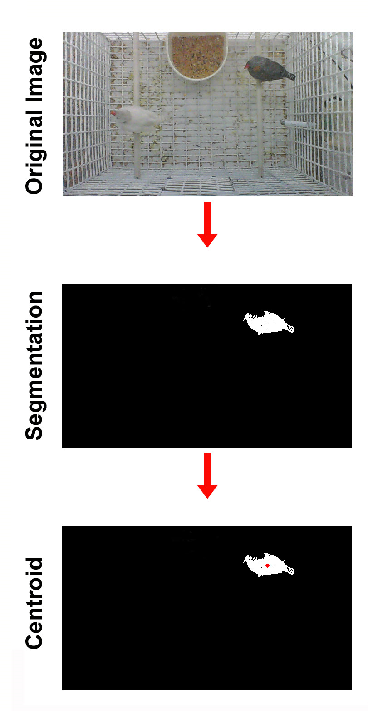
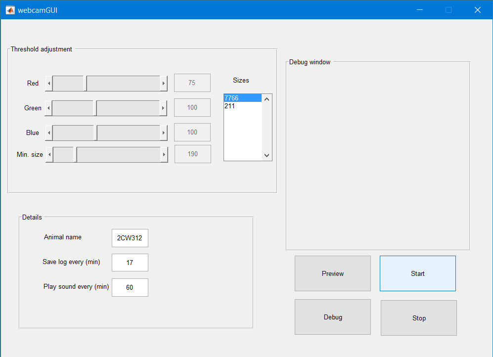

# Help on WebcamGUI - A Simple Finch Tracking Software

*Nhat Le, Summer 2017*

This help file provides some explanations of WebcamGUI, the software for on-line tracking of finch movement. Please email mle@caltech.edu for any questions, suggestion or bug report.

## 1. A Quick Overview

Most commercial tracking softwares extract animal positions from raw video captures. This offline approach can be cumbersome for monitoring of finch activities across multiple days due to the large storage requirements and longer processing time. WebcamGUI is an efficient and low-cost alternative to these softwares, offering several advantages:

1. It allows on-line monitoring of animal activity. The sequence of animal positions is saved as the experiment proceeds. No extra processing time is required to extract finch positions from raw video files.
2. It requires minimal storage space. Since no video is recorded and the log files take up ~60 MB per day per animal, an animal can be tracked continuously across multiple days.
3. It is completely open-source and is available for free.

## 2. Tracking Algorithm

WebcamGUI detects and tracks an animal by recognizing dark regions which stand out against a white background. The program makes use of three thresholds: red, green and blue, which correspond to the R,G,B channels in each pixel. Regions with red, green and blue intensities less than these specified thresholds will be detected as 'animal', while those with brightness exceeding these threshold will be considered as 'background'. The three thresholds can be conveniently adjusted. The current version of the software does not support detecting white animals against dark background, but this feature will be included in a future release.

The tracking process is divided into two steps (see figure below). First, each frame is segmented using a user-defined threshold. Dark pixels, pixels with intensities less than the threshold, will be considered as 'animal'. If several dark areas are detected, only the region with the largest area is considered to be the animal. In the second step, the centroid of the animal region is computed and saved in a log file. Due to the speed of the algorithm, the sequence of centroid positions is saved at a high rate, up to 30 positions a second.

## 3. Set-up of the cage and surroundings

As detailed in section 1, WebcamGUI works best for a dark animal in a white environment. For optimal performance, efforts should be taken to ensure that the environment is as bright as possible to avoid false detection. This includes:

* Making sure the illumination is bright and uniform throughout the camera's field of view.

* Painting the cage white

* For easy detection, we suggest having a transparent top of the cage so that the animal is unobstructed.

* Making sure food trays or water supplies are light-colored.

## 4. Program Use

### a. Software requirements:

A current version of MATLAB should be installed (R2016 or above), together with supporting packages requested by the program. 

### b. Installation instructions:

Download or clone the folder [WebcamGUI](https://github.com/lmn93beo/Finch_Movement/tree/master/WebcamGUI)

Change the working directory in MATLAB to the location of the downloaded folder

In the MATLAB console, type:

`>>>` `webcamGUI`

A pop-up window should appear showing the user interface of the program.

### c. Using the software

Here is a quick overview of the components of the user interface:

* **Threshold scrollbars**: Includes Red, Green and Blue channel components used for thresholding. Higher thresholds are more permissive (more pixels recognized as 'animal')

* **Min size scrollbar**: Used for eliminating 'noise' pixels. Only regions that are larger than this size can be considered as 'animal'. This parameter should be set by referencing the sizes textbox.

* **Sizes textbox**: Display the sizes of the areas detected as animal. Noise areas (detected dark areas that are not the animal) will be displayed as well, but the program only considers the largest area to be the animal. Efforts should be taken to minimize these noise areas.

* **Details box**: Used for inputing parameters for the acquisition: animal name, how often a log file is output by the program, and how often a sound is played.

This last feature is useful if users want to synchronize the log files of webcamGUI and any sound recordings from an independent software. To turn this feature off, simply input '0' into the 'Play sound...' box.

* **Debug window**: Used for displaying the live capture of the animal, and for threshold adjustments.

* **Preview**: Click this before starting to ensure the camera is connected. While previewing, no data is collected.

* **Start**: Click this to start the experiment. Tracking data will be acquired.

* **Debug**: Clicking this will rotate through three views: (1) No display (2) Display live video of animal (3) Display a live detection of animal position.

The live detection mode will show a black/white binary live feed, with white areas corresponding to regions below threshold. A red dot will be shown indicating the centroid of the largest area (presumably the animal's position). The sequence of positions of this red dot will be saved by the program.

For optimal performance, users should return to No display mode once debugging is finished.

* **Stop**: End the recording session.

### d. Step-by-step guide for a typical recording session

1. Set up the cage and ensure bright illumination and background.

2. Start the program by starting MATLAB, going in the webcamGUI directory and type

`>>> webcamGUI`

3. Click 'Preview' to ensure the camera is connected and functioning. If no video feed is shown, check the camera connection.

4. Change the animal name, log saving duration and sound (if needed).

5. Click 'Start'.

6. Click through 'Debug' to make sure the detected position is as desired. If not, manually change the thresholds and minimum size with the scrollbars.

7. Return to the No display mode once Debugging is done.

8. After the session has ended, click 'Stop'.

